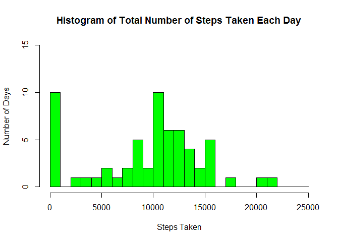
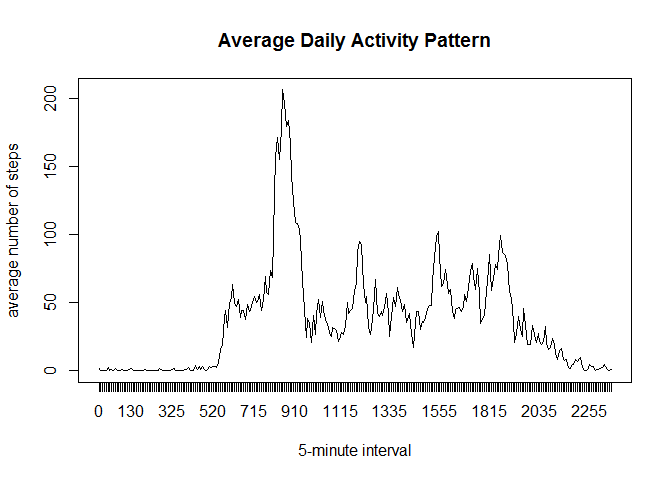
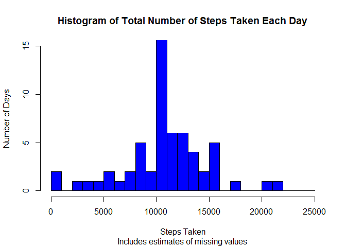
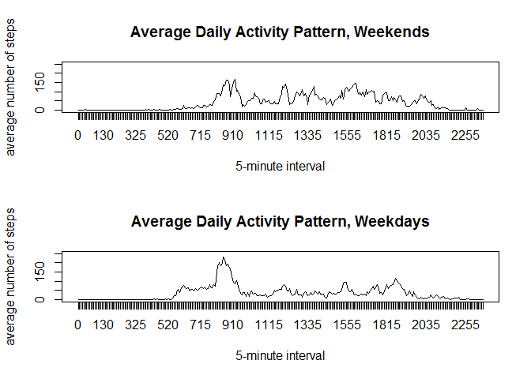

# Reproducible Research: Peer Assessment 1


## Reproducible Research Course Assignment #1
## Analysis of Data from a Personal Activity Monitoring Device

This report describes the analysis of data by a personal activity monitoring device. Data were collected from one individual at 5-minute intervals throughout the day during the months of October and November 2012. The variables include the number of steps taken during each 5-minute interval, the date of the measurement, and the identifier of the 5-minute interval. 


### Part 1: Loading and preprocessing the data
Data were downloaded from the [course website](https://d396qusza40orc.cloudfront.net/repdata%2Fdata%2Factivity.zip) on August 4, 2014.
Data were unzipped and read into R with the following code:


```r
if(!file.exists("activity.csv")){unzip("activity.zip")}
data <- read.csv("activity.csv")
```

Data were then processed, by formatting "date" variable as a date:

```r
data$date <- as.Date(data$date, "%Y-%m-%d")
```

### Part 2: Calculating mean total number of steps taken per day 


```r
dailysteps <- tapply(data$steps, data$date, sum, na.rm=TRUE)
hist(dailysteps, col="green", breaks=seq(from=0,to=25000, by=1000), 
     xlab="Steps Taken", ylab="Number of Days", 
     main="Histogram of Total Number of Steps Taken Each Day",
     ylim=c(0,15))
```

 

Excluding missing values, the total number of steps per day follows the histogram above. 


```r
meandailysteps <- round(mean(dailysteps, na.rm=TRUE),digits=1)
```
**The mean number of steps recorded each day was approximately 9354.2.**


```r
mediandailysteps <- median(dailysteps, na.rm=TRUE)
```
**The median number of steps recorded each day was 10395.**

### Part 3: The average daily activity pattern

```r
intervalsteps <- tapply(data$steps, data$interval, mean, na.rm=TRUE)
plot(x=intervalsteps, type="l", xaxt="n", 
     main="Average Daily Activity Pattern", 
     xlab="5-minute interval", ylab="average number of steps")
axis(side=1, at=1:288, labels=names(intervalsteps))
```

 

The time series plot above shows the average number of steps taken in each five-minute interval. The intervals on the x-axis reflect a 24-hour clock indexed from 0 (midnight) to 2355 (11:55 PM). Missing values are excluded.


```r
l <- intervalsteps==max(intervalsteps)
maxinterval <- intervalsteps[l]
maxintervalname <- names(maxinterval)
```
**The maximum average number of steps (206.1698113) was recorded during the interval 835.**

### Part 4: Imputing missing values

```r
missing_values <- is.na(data$steps)
totalNAs <- sum(missing_values)
```

**A total of 2304 values were missing from the data set.** 


```r
aves <- aggregate(steps ~ interval, data=data, mean, na.rm=TRUE)
names(aves) <- c("interval", "avg_steps_for_interval")
data2 <- merge(data, aves)
imputed_steps <- numeric()
for(i in 1:length(data2$steps)){
        if(is.na(data2$steps[i])) imputed_steps[i] <- data2$avg_steps_for_interval[i]
        else imputed_steps[i] <- data2$steps[i]
}
data2 <- cbind(data2, imputed_steps)
```
Missing data were imputed by replacing them with the mean number of steps taken during the same five-minute interval across all other dates in the data set for which values were available. Although any imputation of missing values could bias the result, this seems a reasonable approach if one assumes that the individual's daily routine was roughly similar regardless of whether a measuremnt was recorded. The code above creates a new variable containing the imputed (mean) value if the value had been missing, and the original measured value otherwise.


```r
imputeddailysteps <- tapply(data2$imputed_steps, data2$date, sum)
hist(imputeddailysteps, col="blue", breaks=seq(from=0,to=25000, by=1000),
     xlab="Steps Taken", ylab="Number of Days", 
     main="Histogram of Total Number of Steps Taken Each Day",
     sub="Includes estimates of missing values",
     ylim=c(0,15))
```

 

Including imputed values, the total number of steps per day follows the histogram above. With the imputed values added, more days are closer to the average, and fewer days have less than 1,000 steps, as the many missing values on these dates have been replaced with values that reflect average activity.


```r
meanimputeddailysteps <- round(mean(imputeddailysteps), digits=1)
```
**Including imputed values, the mean number of steps recorded each day was approximately 10766.2.**


```r
medianimputeddailysteps <- round(median(imputeddailysteps), digits=1)
```
**Including imputed values, the median number of steps recorded each day was approximately 10766.2.**

### Part 5: Differences in activity patterns between weekdays and weekends

```r
day <- weekdays(data2$date, abbreviate=FALSE)
weekend <- day=="Saturday" | day=="Sunday"
daytype <- factor(weekend, levels=c(FALSE,TRUE), labels=c("weekday", "weekend"))
data2 <- cbind(data2, daytype)
```
Using the above code, a factor variable was created to indicate whether each measurement was recorded on a weekend (Saturday or Sunday) or a weekday (Monday through Friday).


```r
weekenddata <- subset(data2, daytype=="weekend")
weekendsteps <- tapply(weekenddata$imputed_steps, weekenddata$interval, mean)
weekdaydata <- subset(data2, daytype=="weekday")
weekdaysteps <- tapply(weekdaydata$imputed_steps, weekdaydata$interval, mean)

par(mfrow=(c(2,1)))
plot(x=weekendsteps, type="l", xaxt="n", ylim=(c(0,250)),
     main="Average Daily Activity Pattern, Weekends", 
     xlab="5-minute interval", ylab="average number of steps")
axis(side=1, at=1:288, labels=names(weekendsteps))
plot(x=weekdaysteps, type="l", xaxt="n", ylim=(c(0,250)),
     main="Average Daily Activity Pattern, Weekdays", 
     xlab="5-minute interval", ylab="average number of steps")
axis(side=1, at=1:288, labels=names(weekdaysteps))
```

 

Using the above code, this panel plot was created, comparing the average number of steps taken per 5-minute interval across weekdays and weekends. It shows higher levels of activity early on weekday mornings, but somewhat lower weekday activity at most points in the afternoon and evening.
